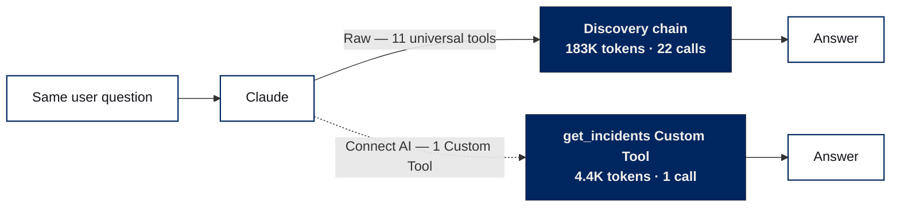

# Connect AI Token Benchmark

A measured benchmark of how CData Connect AI features reduce Claude token usage
on a multi-source enterprise query. Full methodology, reproducible code, and
the locked numbers.

## Headline result

| Scenario     | Total tokens | Reduction | $ / query |
| ------------ | -----------: | --------: | --------: |
| Raw baseline |      183,541 |        -- |    $0.596 |
| Custom Tools |    **4,427** | **97.6%** | **$0.027** |

Full breakdown in `output/results.md` (regenerate via `python render_final.py`).

## The shape of the win



Same question, two paths. Raw baseline walks the universal-tool discovery chain
(getCatalogs &rarr; getSchemas &rarr; getTables &rarr; getColumns &rarr; queryData &rarr; ...).
With Connect AI, one scoped Custom Tool collapses that to a single call.

> Static asset: `output/token-flow-simple.webp` (for use in HTML / docs).
> Full elaborate hero diagram: `output/token-flow.webp`.

## Methodology snapshot

- Real multi-turn execution against live CData Connect AI MCP
- `POST /v1/messages` on the Anthropic API per turn
- Token counts read live from `usage.input_tokens` and `usage.output_tokens`
- 4 to 16 sequential runs per scenario (60 to 75s cooldowns between runs)
- Temperature=0, max_tokens=1024, max_turns=6 (10 for Raw baseline)
- 56 total locked runs across 8 scenarios
- Model: `claude-sonnet-4-6`; pricing: $3.00 / MTok input, $15.00 / MTok output

## How to read this benchmark

**The benchmark measures discovery cost compression.** Connect AI's Custom
Tools, Derived Views, and Workspaces work by replacing Claude's runtime schema
discovery with admin-curated tool surfaces. A 97.6% reduction means the
discovery work moved from Claude's runtime (input tokens) to the admin's
design-time (one-time setup of the Custom Tool).

**The reduction is real and reproducible**, but its size depends on three
factors that vary per deployment:

1. **Tool coverage.** If your admin has built Custom Tools that match the
   queries your users actually send, you will see numbers in this range.
   Queries that fall outside the tool library hit Raw-like discovery costs.
2. **Query shape.** A 3-source cross-system query (this benchmark) maximises
   the discovery surface that Connect AI compresses. A single-source lookup
   shows smaller wins because there is less discovery to skip in the first
   place.
3. **Caching scope.** Connect AI's Caching feature is optimised for warm
   single-source reuse. The number you see for the Caching scenario here
   reflects the specific cross-source query and the relational-source
   constraint (Snowflake cannot be cached); single-source caching produces
   different (typically better) numbers.

The headline 97.6% is the **measured best-case payoff when a Custom Tool is
well-aligned to the query** -- not an average across an unknown query
distribution.

## Contents

```
connectai-token-benchmark/
+-- README.md                          this file
+-- BRIEF.pdf                          original content brief (context)
+-- BENCHMARK-PROMPTS-AND-QUERIES.md   every system prompt, user prompt, SQL
+-- LOCKED_RESULTS.py                  final published numbers (source of truth)
+-- render_final.py                    regenerate results.md + charts (no API calls)
+-- run_benchmark.py                   re-fire the benchmark from scratch
+-- config.py                          endpoints, pricing, query, model
+-- requirements.txt
+-- .env.example                       credentials + source-name template
+-- benchmark/                         core package
|   +-- mcp_client.py                  SSE-aware MCP JSON-RPC client
|   +-- normalizer.py                  MCP to Anthropic tool schema converter
|   +-- scenarios.py                   8 scenario definitions
|   +-- runner.py                      count_tokens + messages.create
|   +-- pricing.py                     cost math (Sonnet 4.6 list price)
|   +-- reporter.py                    JSON + CSV + Markdown + per-run ledger
|   +-- charts.py                      matplotlib charts + Mermaid render
+-- seed/                              data + per-source loading docs
|   +-- accounts.csv, incidents.csv, opportunities.csv  (50 rows each, BMK prefix)
|   +-- derived_view.sql               CREATE statement for the Derived View
|   +-- cleanup.sql                    DELETE WHERE ... LIKE 'BMK%' templates
|   +-- load-google-sheets.md           easy mode: three Google Sheets connections
|   +-- load-salesforce.md, load-servicenow.md, load-snowflake.md  authentic mode
+-- output/
    +-- results.md, .json, .csv        regenerated by render_final.py
    +-- run_ledger.jsonl               one line per individual run (audit trail)
    +-- chart-*.webp                   4 brand-palette charts
    +-- token-flow.webp/.png/.mmd      elaborate hero diagram (full discovery chain)
    +-- token-flow-simple.webp/.png/.mmd  simple two-path illustration (README + KB inline)
    +-- _fixtures.json                 cached MCP tool lists (offline replay)
```

## To reproduce -- pick your path

Three ways to run this benchmark, in order of setup effort. All three use
the same scenario set and code -- only the underlying data sources change.

| Path | Setup time | API spend | Reproduces |
| :-- | :-- | :-- | :-- |
| **A. Offline render** | 0 min | $0 | Locked headline numbers, charts, tables straight from `LOCKED_RESULTS.py` |
| **B. Google Sheets (easy)** | ~10-15 min | ~$6 (n=3 runs) | Methodology + reduction trend; absolute numbers land near locked (Raw baseline slightly lower) |
| **C. Salesforce + ServiceNow + Snowflake (authentic)** | ~45-60 min | ~$6 (n=3 runs) | Locked headline numbers exactly (within multi-turn variance) |

### Prerequisites (all paths)

- Python 3.10+ and `pip install -r requirements.txt`
- An Anthropic API key (B / C only) -- ~$6 for `--runs 3`, ~$18 for `--runs 10`
- A CData Connect AI account (B / C only) -- [free trial](https://cloud.cdata.com/signup/)

### Path A: Offline render (0 min, $0)

Regenerate the published charts and tables from the locked numbers. No API
calls, no Connect AI account needed.

```powershell
pip install -r requirements.txt
python render_final.py
```

Output lands in `output/results.md` plus the four chart WebPs and the two
Mermaid flow diagrams.

### Path B: Google Sheets (~10-15 min, ~$6)

Easiest live reproduction. Copy three public Google Sheets, create three
Google Sheets connections in Connect AI, run.

1. Follow `seed/load-google-sheets.md` -- it walks through the sheet copies,
   the three CData connections, and the Derived View create.
2. Set `CDATA_ITSM_CATALOG`, `CDATA_CRM_CATALOG`, `CDATA_WH_CATALOG` in
   `.env` to the connection names you chose (`BMK_ITSM`, `BMK_CRM`,
   `BMK_WH`).
3. Run:

   ```powershell
   python run_benchmark.py --full --runs 3
   ```

Your numbers will land near the locked headline. The Raw baseline drops a
bit (Google Sheets has a leaner schema than enterprise Salesforce / SN /
Snowflake), so the 97.6% reduction will read as somewhere in the 93-97%
range. The trend reproduces; the absolute values shift slightly.

### Path C: Salesforce + ServiceNow + Snowflake (~45-60 min, ~$6)

For an authentic reproduction of the exact published numbers.

1. Load the seed data per source:
   - `seed/load-salesforce.md` -- accounts (50 rows, `BMK_` prefix)
   - `seed/load-servicenow.md` -- incidents (50 rows, `BMK-` prefix)
   - `seed/load-snowflake.md` -- opportunities (50 rows, joined by account_id)
2. Create three connections in Connect AI (one per source).
3. Create the Derived View using `seed/derived_view.sql`.
4. Set `CDATA_ITSM_CATALOG`, `CDATA_CRM_CATALOG`, `CDATA_WH_CATALOG` in
   `.env` to the connection names you chose.
5. Run:

   ```powershell
   python run_benchmark.py --full --runs 3       # ~$6, ~1.5 hrs
   python run_benchmark.py --full --runs 10      # ~$18, ~5 hrs (publishable CIs)
   ```

### Configure once for B or C

```powershell
Copy-Item .env.example .env
# Edit .env:
#   - ANTHROPIC_API_KEY, CDATA_EMAIL, CDATA_ACCESS_TOKEN
#   - CDATA_ITSM_CATALOG / CRM_CATALOG / WH_CATALOG (your connection names)
#   - DERIVED_VIEW_NAME (default BMK_Incident_Account_Revenue)
#   - MCP_WORKSPACE_URL, MCP_TOOLKIT_URL (optional)
```

### `--skip-mcp` (offline multi-turn, validates the harness)

If you have an Anthropic API key but no CData connections, pass `--skip-mcp`:

```powershell
python run_benchmark.py --skip-mcp --full --runs 3
```

The runner uses the cached tool definitions from `output/_fixtures.json`
and routes every `tool_use` to synthetic payloads. The dispatch is
short-circuited, so numbers will be smaller than the live paths -- but the
harness, scenarios, and aggregation all run end-to-end. Useful for
validating that the kit works before committing to Path C.

## Safety

- Connect AI runs as the user who issued the PAT. **Use a read-only PAT-bound
  user**, ideally in a dev org. The benchmark only reads; a misconfigured
  external job that shares the same credentials could write.
- Every seeded row is prefixed `BMK_` (accounts) or `BMK-` (tickets). Every
  WHERE clause is scoped to that prefix. The benchmark touches its own rows
  only.
- `seed/cleanup.sql` removes BMK-prefixed rows when you are done.

## Citing this benchmark

If you publish numbers from your own reproduction, please link back to:
- The original blog post: *Reduce Your Claude Token Usage by 97% with CData Connect AI*
- This repo

Your numbers will differ from ours; that's expected. The **reduction trend**
across scenarios is what reproduces.
